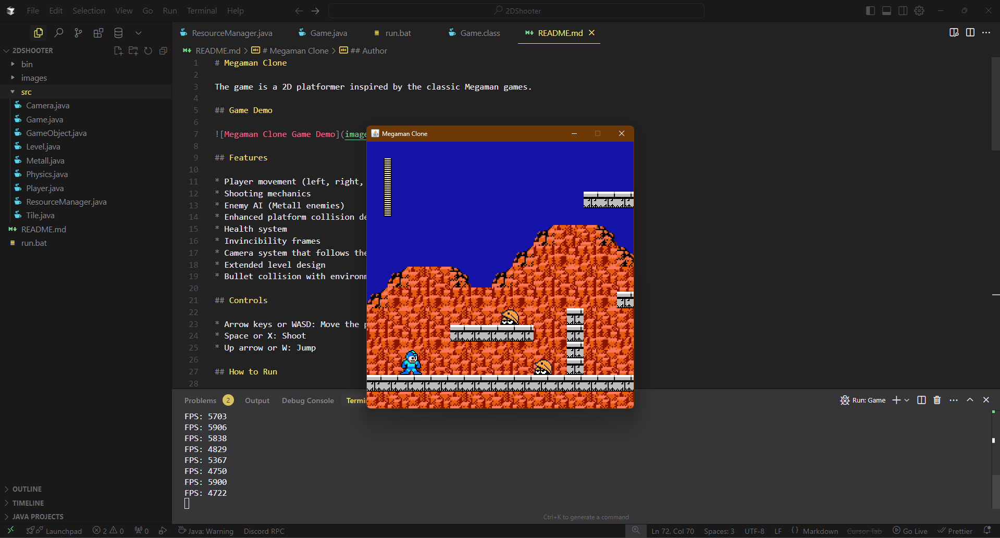

# Megaman Clone

The game is a 2D platformer inspired by the classic Megaman games.

## Game Demo



## Features

* Player movement (left, right, jump)
* Shooting mechanics
* Enemy AI (Metall enemies)
* Simple platform collision detection
* Health system
* Invincibility frames
* Camera system that follows the player
* Extended level design
* Bullet collision with environment

## Controls

* Arrow keys or WASD: Move the player
* Space or X: Shoot
* Up arrow or W: Jump

## How to Run

1. Make sure you have Java JDK 8 or higher installed
2. Run one of the provided scripts:

   **On PowerShell:**
   ```
   .\run.bat
   ```

   **Manual compilation:**
   ```
   mkdir -p bin
   javac -d bin src/*.java
   java -cp bin Game
   ```

**Note:** The game requires the 'images' folder to be in the same directory as where you run the game from.

## Project Structure

* `src/Game.java`: Main game class with game loop and rendering
* `src/GameObject.java`: Base class for all game objects
* `src/Player.java`: Player character with movement and shooting
* `src/Metall.java`: Enemy class with AI and shooting
* `src/Tile.java`: Platform tiles
* `src/Physics.java`: Physics constants
* `src/ResourceManager.java`: Image loading and resource management
* `src/Camera.java`: Camera system that follows the player
* `src/Level.java`: Level design and object placement

## Game Mechanics

* **Collision Detection**: Improved collision system for smoother interaction with platforms
* **Camera System**: Camera follows the player with proper bounds at level edges
* **Level Design**: Extended level with multiple platforms, gaps, and obstacles
* **Enemy AI**: Enemies track player position and shoot when player is in range
* **Bullet Physics**: Bullets collide with environment and are removed when hitting obstacles

## License

This project is open source and available for personal and educational use.

## Author

- **Salah Boussettah** - [GitHub](https://github.com/SalahBoussettah)